### ITs about SELECT STATMENTS!!
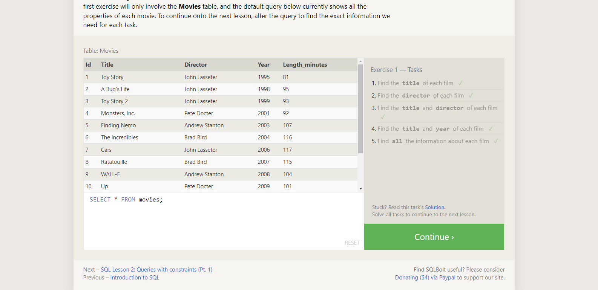

### QUERIES WITH CONSTRAINTS 
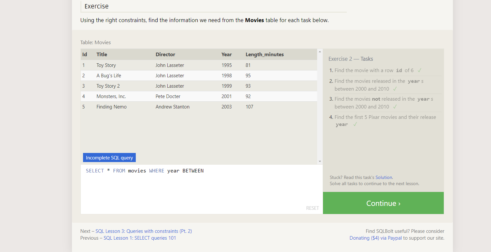

### QUERIES WITH CONSTRAINTS Part 2
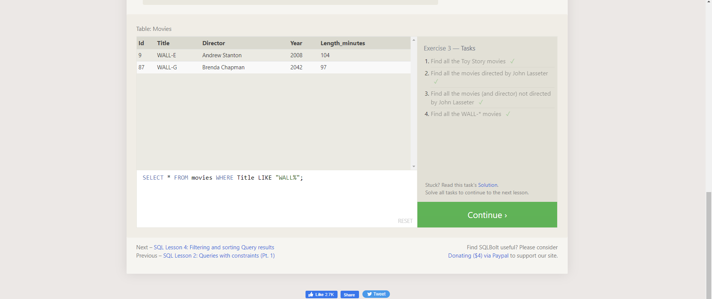

### Filtering And Sorting Query 
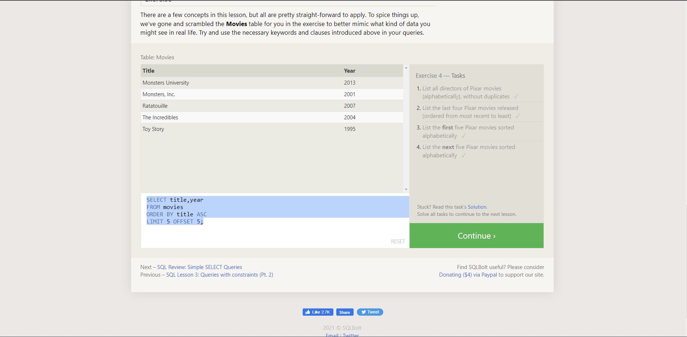

### SQL Review: Simple SELECT Queries
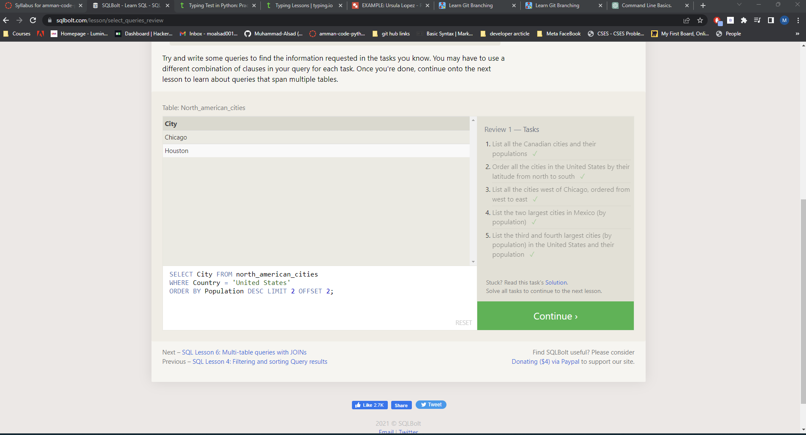

### Multi-table queries with INNER JOIN 
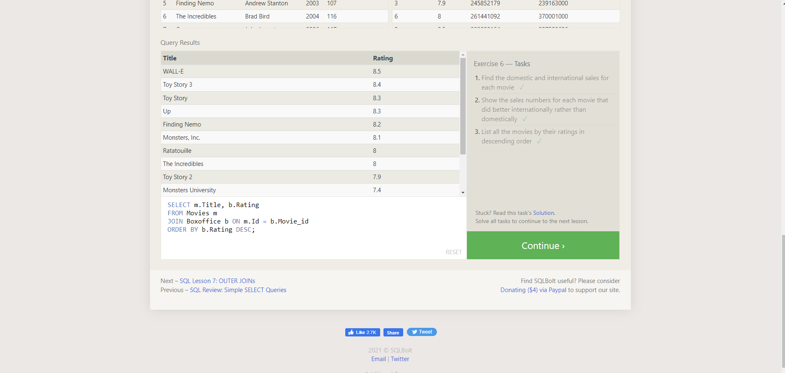

### Learn How To Inserting rows 
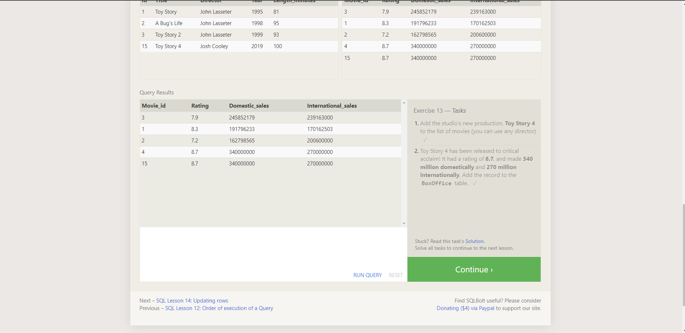

### Learn How To Updating rows
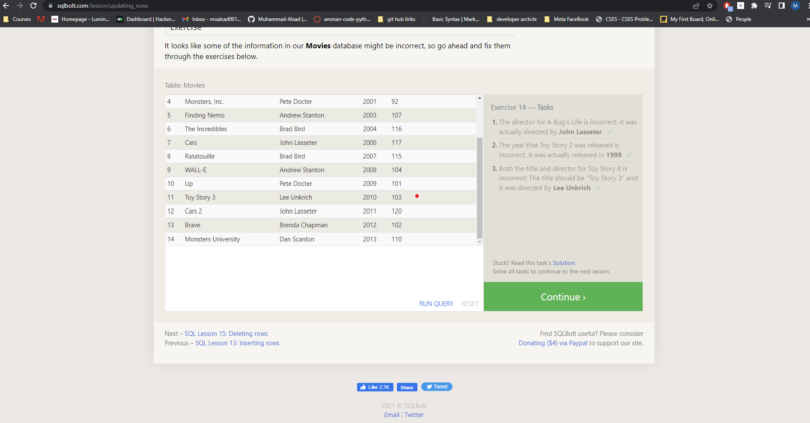

###  Learn How To Deleting rows
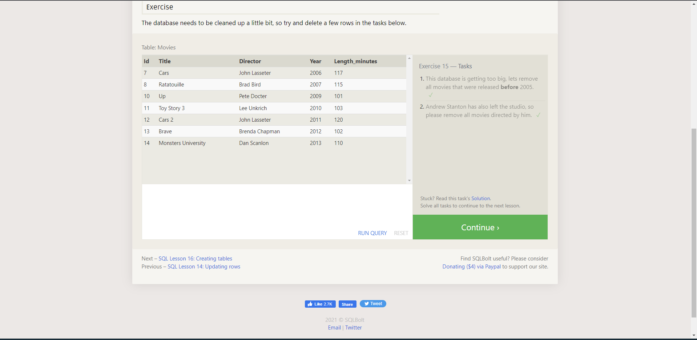

### Learn How To  Creating tables 
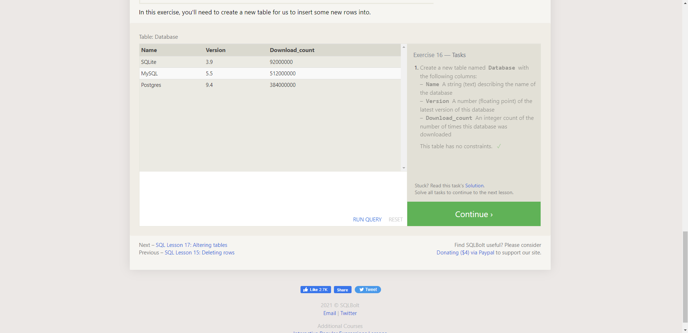

### Altering tables
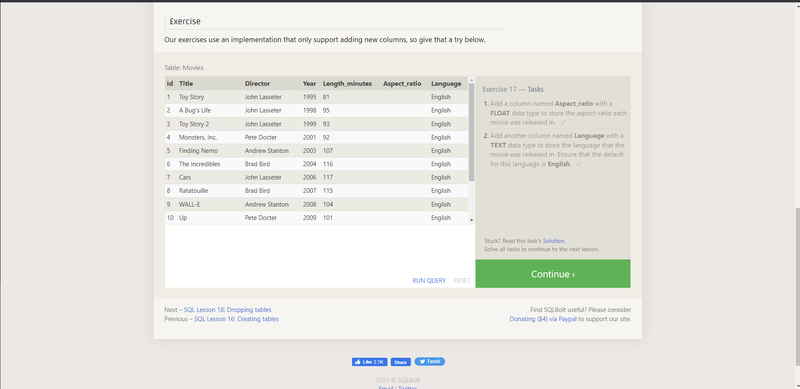

### Learn How To Dropping tables
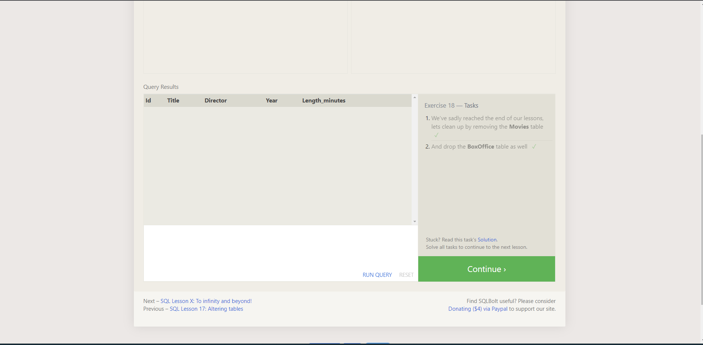
